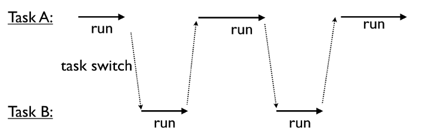
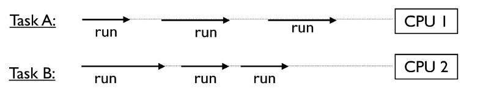
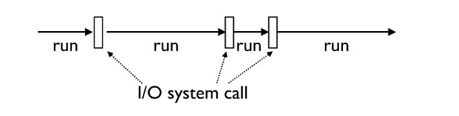
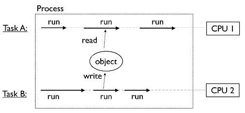
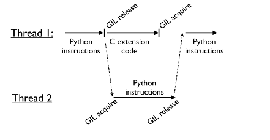
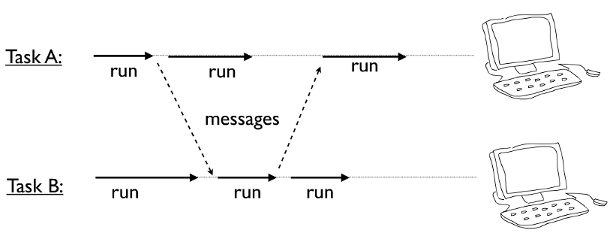
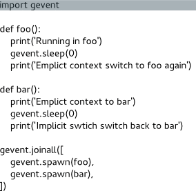

# Introduction to **gevent**

## One of the best kept secrets of Python

*by Matias Guijarro*

#### Grenoble Python Users Meeting, 16/04/2014 

---

# About the speaker

---

# A refresher on Concurrency

---

# Concurrency

* **Simultaneous** execution

* Potentially **interacting** tasks

* Examples
    - a network server that communicates with several hundred clients all connected at once
    - a big number crunching job that spreads its work across multiple CPUs

---

# Multitasking

* Concurrency implies multitasking

* If only 1 CPU is available, the only way to run multiple tasks is by rapidly switching between them

---

# Parallel processing

* In the case of multiple CPUs

* If total number of tasks exceeds the number of CPUs, then each CPU also multitasks

---

# Task execution

* All tasks execute by alternating between CPU processing and I/O handling

* For I/O, tasks must wait (sleep)

* Behind the scenes, the underlying system will carry out I/O operation and wake the task when it's finished

---

# Overview of Concurrency models

---

# Ways to Concurrency

* Traditional multithreading
    - OS threads
    - Shared memory, locks, etc.

* "Actor model" (from Erlang)
    - Multiple processes, share nothing
    - Messaging

* Async or Evented I/O
    - I/O loop + callback chains

---

# OS Threads

* What most programmers think of when they hear about "concurrent programming"

* Independent task running inside a parent program
    - relatively lightweight
    - share the memory and state of its parent
    - gets its own stack
    - independent flow of execution

---

# Programming with threads is hard

---

# **Really** hard

---

# Shared memory

* Tasks may run in the same memory space

* Simultaneous access to objects 

* Often a source of unspeakable peril

---

# Access to Shared Data

* Threads share all data in your program

* Thread scheduling is non-deterministic

* Operations often take several steps and might be interrupted mid-stream (non-atomicity)

* Thus, access to any kind of shared data is also non-deterministic !

---

# Problems with threads

* Race conditions
    - The corruption of shared data due to thread scheduling is often known as a "race condition"
    - It's quite diabolical--a program may produce slightly different results each time it runs
    - Or it may just flake out mysterioulsy once every two weeks...

* Threads needs to be synchronized
    - Synchronization primitives: locks, semaphores, mutexes
    - A lot harder than it seems => deadlocks, nasty corner cases   

---

# Problems with threads with Python

* Global Interpreter Lock
    - Only one Python thread can execute in the interpreter at once
    - GIL ensures each thread gets *exclusive* access to entire interpreter

* Whenever a thread run, it holds the GIL
    - Impossible to have true parallelism
    - Except when having C extensions that release the GIL   

---

# The Actor Model (Erlang) "in Python"

* An alternative to threads is to run multiple independent copies of the Python interpreter
    - In separate processes
    - Possibly on different machines
    - Get the interpreters to communicate through "message passing" (IPC)
        - Pipes, FIFOs, memory mapped regions, sockets, etc.

---

# Multiprocessing module

* Multiprocessing module is part of standard Python since 2.6
    - It mirrors Python's threading API

* Messaging implies serialization
    - convert Python objects to a byte stream 
    - done through the standard "pickle" module

---

# The third path to Concurrency: Async. or Evented I/O

---

# CPU bound tasks

* A task is "CPU bound" if it spends most of its time with little I/O

* Examples
    - Crunching big matrices
    - Image processing

---

# I/O bound tasks

* A task is "I/O bound" if it spends most of its time waiting for I/O

* Examples
    - Reading input from user
    - GUI
    - Networking
    - File processing

* **Most programs are I/O bound**

--- 

# Async. or Evented I/O

* "non-blocking I/O"

* permits other processing to continue before I/O operation has completed
    - one of the main function of Operating Systems (e.g old "select" sys. call)

* more scalable than threads or processes (much less memory consumption)

* usually gives great response time, latency and CPU usage on I/O bound programs

* one single main thread (SPED: Single Process Event Driven)
      - lots of troubles are avoided, easier to debug

---

# Async. or Evented I/O

* No silver bullet, though
    - a loop has to run to dispatch I/O operations
    - callbacks "spaghetti" make code less readable

* Recent progress on Linux kernel since 2.6 (better threading) and 64-bits
architecture (more memory) make it less interesting than before in
term of pure performance

---

# What is the best approach ?

---

# Depends on the problem :)

---

# The C10k problem (D. Kegel, 1999)

* Comes from web servers world *(I/O bound process)*
    - How to handle 10.000 simultaneous connections ?

---

# The C10k problem (D. Kegel, 1999)

* Since 1999, solutions have emerged
    - 2002: Nginx, Lighttpd
        - successfully uses the Asynchronous I/O paradigm
        - 1 single thread to serve them all
    - 2003: "Why events are a bad idea (for High-concurrency servers)"
        - paper from Behren, Condit and Brewer (University of California, Berkeley)
        - read the paper! Conclusions:
            - weaknesses of threads (in term of performance) are artifacts of
              current implementations
            - compilers *will* evolve to help with thread safety issues
            - threads => classic programming model (no I/O callbacks)

---

---

---

# 2nd part: **gevent**

---

# What is gevent ?

* Python concurrency library

* based around:
    - <a href="http://software.schmorp.de/pkg/libev.html">libev</a>
    - <a href="http://greenlet.readthedocs.org/en/latest/">greenlet</a>
 
* clean API for a variety of concurrency and network related tasks 

---

# Talk is cheap - show me the code

* Download of 4 files over the Internet
    - Using threads
    - Using async I/O
    - Using gevent

Files are taken from the W3C web site: http://www.w3.org

    !python
    files = ("/TR/html401/html40.txt", 
             "/TR/2002/REC-xhtml1-20020801/xhtml1.pdf",
             "/TR/REC-html32.html",
             "/TR/2000/REC-DOM-Level-2-Core-20001113/DOM2-Core.txt")
   
---

# Threaded version

    !python
    class download_task(threading.Thread):
      def __init__(self, host, filepath, proxy="proxy.esrf.fr:3128"):
        threading.Thread.__init__(self)

        self.host = host
        self.filepath = filepath
        self.proxy = proxy
        self.file_contents = ""

      def run(self):
        s = socket.socket(socket.AF_INET, socket.SOCK_STREAM)
        proxy_host, proxy_port = self.proxy.split(":")
        s.connect((proxy_host, int(proxy_port)))

        s.send("GET http://"+self.host+self.filepath+" HTTP/1.0\r\n\r\n")

        buf = []
        while True:
          data = s.recv(1024)
          if not data:
            break
          buf.append(data)

        s.close()
        self.file_contents = "".join(buf)

    tasks = []
    for filepath in files:
      tasks.append(download_task("www.w3.org", filepath, "proxy.esrf.fr:3128"))
    [task.start() for task in tasks]
    [task.join() for task in tasks]

---

# Asynchronous flavor

Use of the 'asyncore' standard Python module. Callbacks are
fired when socket is ready to do a non-blocking read or
write operation.

    !python
    class download_task(asyncore.dispatcher):
      def __init__(self, host, filepath, proxy="proxy.esrf.fr:3128"):
        asyncore.dispatcher.__init__(self)

        self.host = host
        self.filepath = filepath
        self.proxy = proxy
        self.buffer = []
        self.file_contents = ""
        self.request_sent = False

      def start(self):
        self.create_socket(socket.AF_INET, socket.SOCK_STREAM)
        proxy_host, proxy_port = self.proxy.split(":")
        self.connect((proxy_host, int(proxy_port)))

      def handle_close(self):
        self.close()
        self.file_contents = "".join(self.buffer)

      def handle_read(self):
        data = self.recv(1024)
        self.buffer.append(data)

      def writable(self):
        return not self.request_sent

      def handle_write(self):
        self.send("GET http://"+self.host+self.filepath+" HTTP/1.0\r\n\r\n")
        self.request_sent = True
    
    tasks = []
    for filepath in files:
      tasks.append(download_task("www.w3.org", filepath, "proxy.esrf.fr:3128"))
    [task.start() for task in tasks]
    
    asyncore.loop()

---

# Gevent version

A synchronous adapter for fully asynchronous communication, without callbacks

    !python
    def download_task(host, filepath, proxy="proxy.esrf.fr:3128"):
      s = socket.socket(socket.AF_INET, socket.SOCK_STREAM)
      proxy_host, proxy_port = proxy.split(":")
      self.connect((proxy_host, int(proxy_port)))
  
      s.send("GET http://"+host+filepath+" HTTP/1.0\r\n\r\n")

      buf = []
      while True:
        data = s.recv(1024)
        if not data:
          break
        buf.append(data)

      s.close()
      return "".join(buf)

    tasks = []
    for filepath in files:
      tasks.append(gevent.spawn(download_task, "www.w3.org", filepath, "proxy.esrf.fr:3128"))
    gevent.joinall(tasks)

---

# How does it work ?

---

---

# greenlet

* greenlet provides **coroutines** to Python via a C extension module

* spin-off of **Stackless**, a version of Python supporting micro-threads
    - micro-threads are coroutines + a scheduler

* the idea of coroutine is from a 1963 paper from Melvin Conway
    - like a normal subroutine, except that it has *yielding points*
      instead of a single return exit
    - when yielding, execution goes to another coroutine

* **gevent trick #1**: yield automatically when doing blocking I/O
  (or when 'sleeping')
    - libev provides efficient async. I/O and a scheduler

---

# greenlet

Execution flow example

Greenlets execution is deterministic. No preemption.

**Cooperative scheduling**

---

---

# **gevent trick #2** to the rescue

---

# Monkey-patching
### from gevent import monkey; monkey.patch_all()

* Python allows for most objects to be modified at runtime including modules, classes, and even functions
    - this is generally an astoudingly bad idea!!!
    - nevertheless in extreme situations where a library needs to alter the fundamental behavior of Python itself monkey      patches can be used

* gevent patches blocking system calls in the standard library including those in socket, ssl, threading and select modules to instead behave cooperatively

* Beware
    - libraries that wrap C libraries
        - it is possible to patch those: <a href="https://github.com/hongqn/greenify">greenify</a> (but requires recompiling)
    - disk I/O

---

---

# gevent features

* Greenlet objects (aka **tasks**)
    - spawn, spawn_later, pause, kill, join...
    - ready, link, get
        - can even be used to implement **futures**

* Since gevent 1.0, **gevent.threadpool** helps running blocking code in real OS threads, synchronized with gevent loop

---

# gevent features

Timeouts

    !python
    with gevent.Timeout(5):
      response = urllib2.urlopen(url)
      for line in response:
        print line
    # raises Timeout exception if not done after 5 seconds

---

# gevent features

* API
    - Event & AsyncResult objects
    - Queues
    - Greenlets Groups & Pool
    - TCP, SSL & WSGI servers
    - Locks and Semaphores (almost never needed)

---

# gevent and Python 3

* Python 3.4 introduces Tulip (asyncio module)
    - will be in a final shape in Python 3.5
    - native support for asynchronous I/O

* gevent embraces the change
    - received many contributions from the community
    - working implementation compatible with Python 3 in <a href="https://github.com/surfly/gevent">gevent repository</a>

---

# Third part: gevent in a bottle

---

# Bottle: Python web framework

* Lightweight WSGI **micro** framework
    - one single Python module file !
    - no dependencies other than standard library
    - runs on Python 2.5+ and 3.x

* <a href="http://bottlepy.org">Link to web page</a>

---

# Bottle: Python web framework

* Designed for prototyping and building small web applications and services
    - compares to <a href="http://flask.pocoo.org/">Flask</a>
    - pushes the single-file approach to the limit

* Misses some advanced features and ready-to-use solutions found in other frameworks
    - MVC
    - ORM (Object-Relational Mapping)
    - Scaffolding (automatic code generation for application database control), made popular by Ruby On Rails
    - Form validation
    - XML-RPC 

---

# Luckily we don't need all this to have fun :)

---

# Asynchronous Applications with Bottle+gevent

* Most servers limit the size of their worker pools to a low number of concurrent OS threads
    - expensive to create for a large number of connections

* Asynchronous design patterns don’t mix well with the synchronous nature of WSGI
    - most asynchronous frameworks (tornado, twisted...) implemented a specialized API

* gevent applications are massively "multi-threaded" with greenlets
    - the best of both worlds
    - writing asynchronous applications is extremely easy, as they look and feel like synchronous 

--- 

# Thanks for your attention :) Questions ?

---
